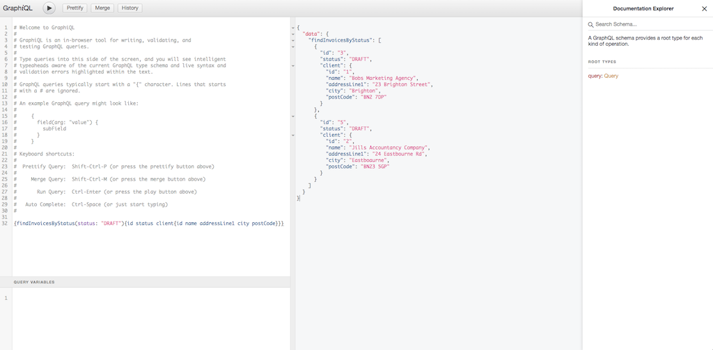

# A Spring Boot/GraphQL Example App

Source: https://github.com/leeturner/spring-boot-graphql-example

This is a little Spring Boot REST application exposing a GraphQL interface designed to show the minimum needed to get up
and running with GraphQL. It is basically the result of a few hours over a weekend to lean about what GraphQL is and
what it brings to the table for REST based Spring Boot apps. At the moment this project only supports GraphQL `Query`s (
retrieving data from our service).  `Mutation`s (updating data managed via our service) will be coming soon.

## H2 Database

This app uses the H2 in-memory database and JPA to expose 2 simple entities - an `Invoice` and a `Client`. In this
example, a `Client` can have multiple `Invoice`'s issued to them. This is mapped by the JPA `@ManyToOne` annotation.

The H2 console has been enabled via adding these properties in the `application.properties` file:

```properties
spring.h2.console.enabled=true
spring.h2.console.path=/h2-console
```

The console can be accessed via this url - [http://localhost:8080/h2-console](http://localhost:8080/h2-console)

Once running you can authenticate against the in-memory database using the following credentials:

* Driver Class: **org.h2.Driver**
* JDBC URL: **jdbc:h2:mem:testdb**
* User Name: **sa**
* Password: [leave blank]

## GraphQL

GraphQL is enabled via adding the starter dependency from `com.graphql-java-kickstart`:

```xml

<dependency>
    <groupId>com.graphql-java-kickstart</groupId>
    <artifactId>graphql-spring-boot-starter</artifactId>
</dependency>
```

This enables the GraphQL servlet on the default location - `/graphql`. In this example we use the GraphQL schema
language to build the `graphql-java` schema. These files are stored in the `/resources/graphql/`:

client.graphqls:

```
type Client {
    id: ID!
    name: String!
    paymentTerms: Int!
    addressLine1: String!
    addressLine2: String
    city: String!
    postCode: String!
}

type Query {
    clients: [Client]
    client(id: Int!): Client
    clientCount: Int
}
```

invoice.graphqls:

```
type Invoice {
    id: ID!
    client: Client!
    status: String!
    issuedDate: String
    currency: String!
    gross: Float!
    net: Float!
    vat: Float!
}

extend type Query {
    invoices: [Invoice]
    invoice(id: Int!): Invoice
    invoicesByStatus(status: String): [Invoice]
    invoiceCount: Int
}
```

## Usage

Pull down the repo and build in the usual way. This is a Java 15 project so make sure you are using the correct version
of the jdk either on the command line or within your IDE.

```
mvn spring-boot:run
```

Once the service is up and running you can query the data using the queries defined in the `.graphqls` files. Below are
some example queries based on the queries we have defined:

Query:

```
{invoiceCount}
```

Result:

```json
{
    "data": {
        "invoiceCount": 3
    }
} 
```

Query:

```
{clientCount}
```

Result:

```json
{
    "data": {
        "clientCount": 2
    }
} 
```

Query:

```
{clients{id name paymentTerms}}
```

Result:

```json
{
    "data": {
        "clients": [
            {
                "id": "1",
                "name": "Bobs Marketing Agency",
                "paymentTerms": 28
            },
            {
                "id": "2",
                "name": "Jills Accountancy Company",
                "paymentTerms": 28
            }
        ]
    }
} 
```

You will notice that the above query does not contain all the data managed by the `Client` entity. We can return more or
less data in the response by changing the fields in the query:

Query:

```
{clients{id name paymentTerms addressLine1 addressLine2 city postCode}}
```

Result:

```json
{
  "data": {
    "clients": [
      {
        "id": "1",
        "name": "Bobs Marketing Agency",
        "paymentTerms": 28,
        "addressLine1": "23 Brighton Street",
        "addressLine2": "Rottingdean",
        "city": "Brighton",
        "postCode": "BN2 7DP"
      },
      {
        "id": "2",
        "name": "Jills Accountancy Company",
        "paymentTerms": 28,
        "addressLine1": "24 Eastbourne Rd",
        "addressLine2": null,
        "city": "Eastboaurne",
        "postCode": "BN23 5GP"
      }
    ]
  }
} 
```

The same applies for the `invoices` query although this one is a little more interesting given its relationship to
the `Client` entity. Using GraphQL we can traverse the object graph and return the `Client` data along with the invoice:

Query:

```
{invoices{id status gross net vat client{id name}}}
```

Result:

```json
{
  "data": {
    "invoices": [
      {
        "id": "3",
        "status": "DRAFT",
        "gross": 120,
        "net": 100,
        "vat": 20,
        "client": {
          "id": "1",
          "name": "Bobs Marketing Agency"
        }
      },
      {
        "id": "4",
        "status": "ISSUED",
        "gross": 1200,
        "net": 1000,
        "vat": 200,
        "client": {
          "id": "1",
          "name": "Bobs Marketing Agency"
        }
      },
      {
        "id": "5",
        "status": "DRAFT",
        "gross": 120,
        "net": 100,
        "vat": 20,
        "client": {
          "id": "2",
          "name": "Jills Accountancy Company"
        }
      }
    ]
  }
}
```

As before we can return more or less data across both entities in the same `Query`:

Query:

```
{invoices{id status client{id name addressLine1 city postCode}}}
```

Result:

```json
{
  "data": {
    "invoices": [
      {
        "id": "3",
        "status": "DRAFT",
        "client": {
          "id": "1",
          "name": "Bobs Marketing Agency",
          "addressLine1": "23 Brighton Street",
          "city": "Brighton",
          "postCode": "BN2 7DP"
        }
      },
      {
        "id": "4",
        "status": "ISSUED",
        "client": {
          "id": "1",
          "name": "Bobs Marketing Agency",
          "addressLine1": "23 Brighton Street",
          "city": "Brighton",
          "postCode": "BN2 7DP"
        }
      },
      {
        "id": "5",
        "status": "DRAFT",
        "client": {
          "id": "2",
          "name": "Jills Accountancy Company",
          "addressLine1": "24 Eastbourne Rd",
          "city": "Eastboaurne",
          "postCode": "BN23 5GP"
        }
      }
    ]
  }
}
```

Queries that require additional data such as the `invoicesByStatus` query can be passed as parameters:

Query:

```
{invoicesByStatus(status: "DRAFT"){id status client{id name addressLine1 city postCode}}}
```

Result:

```json
{
  "data": {
    "invoicesByStatus": [
      {
        "id": "3",
        "status": "DRAFT",
        "client": {
          "id": "1",
          "name": "Bobs Marketing Agency",
          "addressLine1": "23 Brighton Street",
          "city": "Brighton",
          "postCode": "BN2 7DP"
        }
      },
      {
        "id": "5",
        "status": "DRAFT",
        "client": {
          "id": "2",
          "name": "Jills Accountancy Company",
          "addressLine1": "24 Eastbourne Rd",
          "city": "Eastboaurne",
          "postCode": "BN23 5GP"
        }
      }
    ]
  }
}
```

All of the above queries can be sent to the service via the url. They need to be URLEncoded for them to work properly.
For example:

```
http://localhost:8080/graphql?query=%7BcountClients%7D
http://localhost:8080/graphql?query=%7Bclients%7Bid%20name%20paymentTerms%7D%7D
http://localhost:8080/graphql?query=%7Binvoices%7Bid%20status%20client%7Bid%20name%20addressLine1%20city%20postCode%7D%7D%7D
http://localhost:8080/graphql?query=%7BinvoicesByStatus(status%3A%20%22DRAFT%22)%7Bid%20status%20client%7Bid%20name%20addressLine1%20city%20postCode%7D%7D%7D
```

### GraphiQL

If you want a more interactive experience then GraphiQL has been enabled via adding the following dependency to the
service:

```xml
<dependency>
  <groupId>com.graphql-java-kickstart</groupId>
  <artifactId>graphiql-spring-boot-starter</artifactId>
  <version>11.1.0</version>
  <scope>runtime</scope>
</dependency>
```

GraphiQL is an in-browser IDE for exploring GraphQL:



The GraphiQL IDE can be accessed at the following URL - [http://localhost:8080/graphiql](http://localhost:8080/graphiql)


