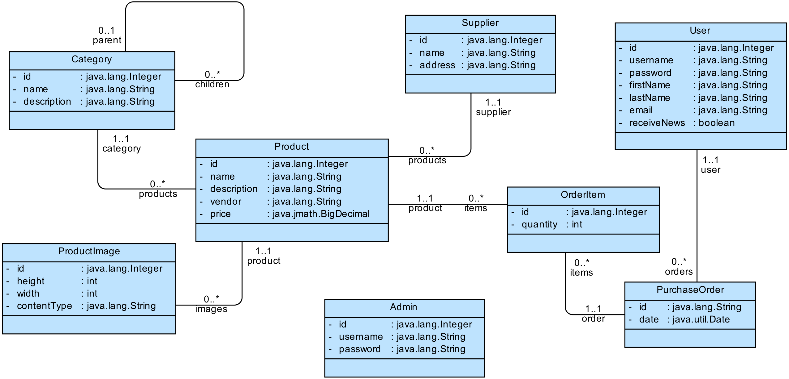

# Anotacijama definisana perzistencija POJO klasa

Mapiranje objektnog modela koji se sastoji iz više povezanih klasa na relacionu 
bazu. Test klasa ilustruje i rad sa objektima unutar i izvan sesije, odnosno 
lazy/eager učitavanje kao i kaskadno upisivanje objekata u bazu.

## Potrebne stvari

* [Gradle](https://gradle.org)

## Priprema primera

Ako se koristi neko od razvojnih okruženja, projekat se može pripremiti 
za njih pomoću komande

`gradle eclipse`

ili 

`gradle idea`

Nakon toga se projekat može otvoriti u izabranom alatu i podešavanja za 
projekat će već biti inicijalizovana.

## Pokretanje primera

Iz osnovnog foldera pokrenuti

`gradle jar`

pa zatim pokrenuti

`java -jar build/libs/pr04.jar`

ili pokrenuti klasu `pr04.Test` iz razvojnog okruženja.

## Sadržaj primera

Model klasa koje se koriste u primeru je sledeći:

